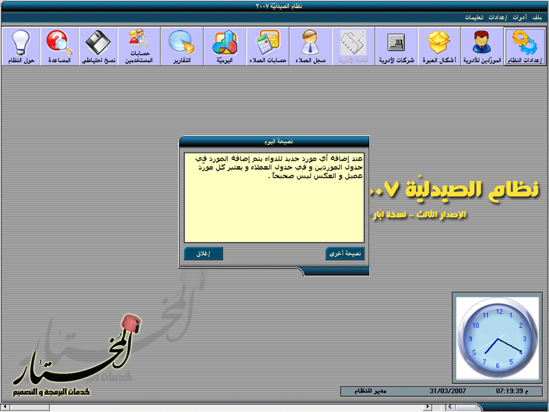



## Pharmacy 2007 Ver 3\.0

### Description

Hi every body

this project is a great pharmacy managment system

which depends on VB6 &amp; Access database .

Note : full support for all types of barcode.

Yes , Download it.

The programmer : Mokhtar Saied Saleh

Syria - Albokamal

www.abokamal.com

mokhtar_ss@hotmail.com
 
### More Info
 

             |
---                |---
**Submitted On**   |2008-02-14 15:02:42
**By**             |[Mukhtar Sayed Saleh](https://github.com/Planet-Source-Code/PSCIndex/blob/master/ByAuthor/mukhtar-sayed-saleh.md)
**Level**          |Advanced
**User Rating**    |4.3 (47 globes from 11 users)
**Compatibility**  |VB 6\.0
**Category**       |[Complete Applications](https://github.com/Planet-Source-Code/PSCIndex/blob/master/ByCategory/complete-applications__1-27.md)
**World**          |[Visual Basic](https://github.com/Planet-Source-Code/PSCIndex/blob/master/ByWorld/visual-basic.md)
**Archive File**   |[Pharmacy\_22101822142008\.zip](https://github.com/Planet-Source-Code/mukhtar-sayed-saleh-pharmacy-2007-ver-3-0__1-70097/archive/master.zip)

